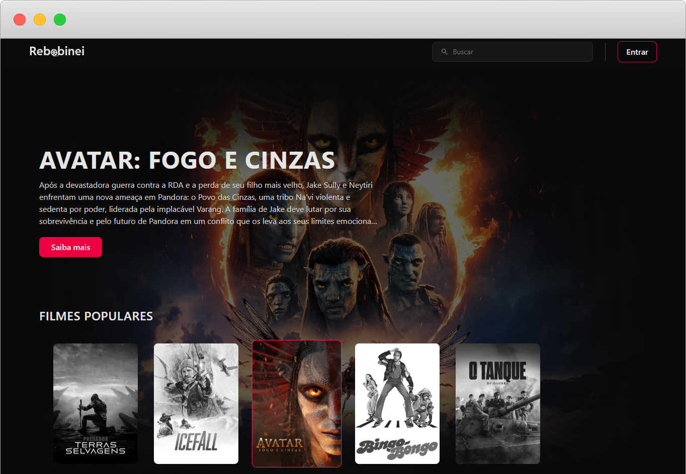
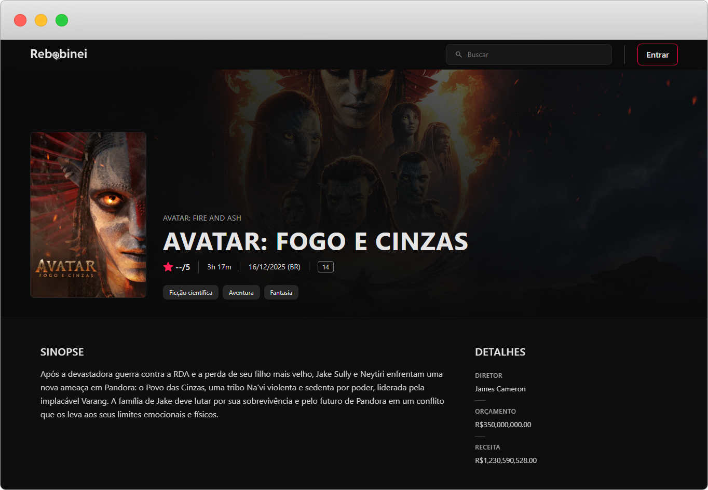

<h1 align="center" style="font-weight: bold;">Rebobinei 🎬</h1>

<p align="center">
  <a href="#layout">Layout</a> • 
  <a href="#tech">Technologies</a> •
  <a href="#started">Getting Started</a>
</p>

<p align="center">
    <b>A platform to explore, rate, and review movies.</b>
</p>

<p align="center">
     <a href="https://rebobinei.vercel.app">📱 Visit this Project</a>
</p>

<h2 id="layout">🎨 Layout</h2>

<p align="center">
    
    
</p>

<h2 id="tech">💻 Technologies</h2>

- Angular
- Tailwind
- Docker & Docker Compose

<h2 id="started">🚀 Getting started</h2>

<h3>Prerequisites</h3>

- [NodeJS](https://nodejs.org/en/download)
- [Git](https://git-scm.com/downloads)
- [Docker](https://www.docker.com/) (Optional)

<h3>Cloning</h3>

```bash
git clone https://github.com/luizfbn/rebobinei.git
```

<h3>Config environments variables</h3>

Use the configuration folder `src/app/environments` to set your API URL.

```bash
apiUrl: '{ YOUR_API_URL }'
```

<h3>Starting</h3>

You can run it using Docker or locally.

Via Docker:

```bash
cd rebobinei
npm run compose:dev # Start development environment
npm run compose:dev:down # Stop environment
```

Locally:

```bash
cd rebobinei
npm install
npm run start
```
